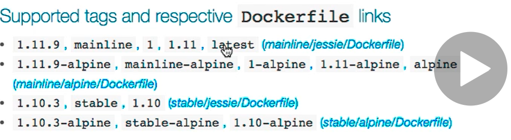
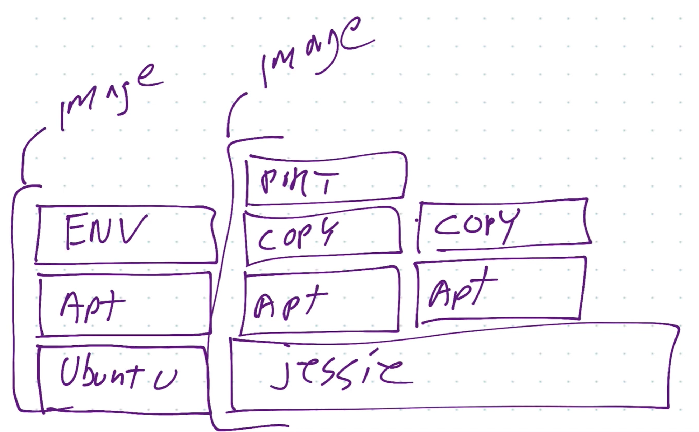

# Docker

## Intro

- Containers allow you to run your software the exact same way regardless of environment
    - Mac, Windows, Linux, Cloud, PC, Datacenter
- 80% of the time of an IT person is spent managing existing software
- 20% time spent innovating
- Docker reduces the maintenance time

<br>

- Containerization doesn't require you to rewrite your application


## Basics

**Image vs Container**

- An image is the application we want to run
- A container is an instance of that image running as a process
- You can have many containers running off the same image
- Docker's default image `registry` is called Docker Hub (hub.docker.com)

<br>

- `docker container run --publish 80:80 nginx`
1. Downloaded image `nginx` from Docker Hub
1. Started a new container from that image
1. Opened port 80 on the host IP
    - We could've used any other unused port here - for example 8888
    - We would've opened to localhost:8888 then
1. Routes that traffic to the container IP, port 80

<br>

- Note that this application runs in the `foreground`

<br>

- `docker container run --publish 80:80 --detach  nginx`

```
PS C:\workspace\udemy-docker-mastery> docker container run --publish 80:80 --detach  nginx
f4a1308093a238b720dc3f4d8e550a46c9b9a1ee189d638523c0d79931f93882
```

- `detach` tells docker to run it in the background
- `docker container ls`

```
PS C:\workspace\udemy-docker-mastery> docker container ls
CONTAINER ID        IMAGE               COMMAND                  CREATED             STATUS              PORTS                NAMES
7e0fe5c2377b        nginx               "/docker-entrypoint.…"   3 minutes ago       Up 3 minutes        0.0.0.0:80->80/tcp   condescending_easley
```

- Stopping a running container

```
PS C:\workspace\udemy-docker-mastery> docker container ls
CONTAINER ID        IMAGE               COMMAND                  CREATED             STATUS              PORTS                NAMES
7e0fe5c2377b        nginx               "/docker-entrypoint.…"   4 minutes ago       Up 4 minutes        0.0.0.0:80->80/tcp   condescending_easley
PS C:\workspace\udemy-docker-mastery> docker stop 7e
7e
PS C:\workspace\udemy-docker-mastery> docker container ls
CONTAINER ID        IMAGE               COMMAND             CREATED             STATUS              PORTS               NAMES
PS C:\workspace\udemy-docker-mastery> 
```

- Showing all containers

```
PS C:\workspace\udemy-docker-mastery> docker container ls -a
CONTAINER ID        IMAGE               COMMAND                  CREATED             STATUS                      PORTS               NAMES
f4a1308093a2        nginx               "/docker-entrypoint.…"   2 minutes ago       Created                                         determined_swirles
7e0fe5c2377b        nginx               "/docker-entrypoint.…"   5 minutes ago       Exited (0) 39 seconds ago                       condescending_easley
```

- Naming a container yourself

```
PS C:\workspace\udemy-docker-mastery> docker container run --publish 80:80 --detach --name webhost nginx
16e23ab8a10e7859b027d67636b4734e6dea6d4343bab5560b0c07e9d84e0ac1
PS C:\workspace\udemy-docker-mastery> docker container ls -a
CONTAINER ID        IMAGE               COMMAND                  CREATED             STATUS                     PORTS                NAMES
16e23ab8a10e        nginx               "/docker-entrypoint.…"   5 seconds ago       Up 4 seconds               0.0.0.0:80->80/tcp   webhost
f4a1308093a2        nginx               "/docker-entrypoint.…"   3 minutes ago       Created                                         determined_swirles
7e0fe5c2377b        nginx               "/docker-entrypoint.…"   6 minutes ago       Exited (0) 2 minutes ago                        condescending_easley
```

- Getting logs of application running in background via --detach

```
PS C:\workspace\udemy-docker-mastery> docker container logs webhost
/docker-entrypoint.sh: /docker-entrypoint.d/ is not empty, will attempt to perform configuration
/docker-entrypoint.sh: Looking for shell scripts in /docker-entrypoint.d/
/docker-entrypoint.sh: Launching /docker-entrypoint.d/10-listen-on-ipv6-by-default.sh
10-listen-on-ipv6-by-default.sh: Getting the checksum of /etc/nginx/conf.d/default.conf
10-listen-on-ipv6-by-default.sh: Enabled listen on IPv6 in /etc/nginx/conf.d/default.conf
/docker-entrypoint.sh: Launching /docker-entrypoint.d/20-envsubst-on-templates.sh
/docker-entrypoint.sh: Configuration complete; ready for start up
172.17.0.1 - - [27/Sep/2020:12:25:24 +0000] "GET / HTTP/1.1" 304 0 "-" "Mozilla/5.0 (Windows NT 10.0; Win64; x64) AppleWebKit/537.36 (KHTML, like Gecko) Chrome/83.0.4103.97 Safari/537.36" "-"
172.17.0.1 - - [27/Sep/2020:12:25:25 +0000] "GET / HTTP/1.1" 304 0 "-" "Mozilla/5.0 (Windows NT 10.0; Win64; x64) AppleWebKit/537.36 (KHTML, like Gecko) Chrome/83.0.4103.97 Safari/537.36" "-"
172.17.0.1 - - [27/Sep/2020:12:25:26 +0000] "GET / HTTP/1.1" 304 0 "-" "Mozilla/5.0 (Windows NT 10.0; Win64; x64) AppleWebKit/537.36 (KHTML, like Gecko) Chrome/83.0.4103.97 Safari/537.36" "-"
```

- Listing processes inside of container

```
PS C:\workspace\udemy-docker-mastery> docker container top webhost
PID                 USER                TIME                COMMAND
2256                root                0:00                nginx: master process nginx -g daemon off;
2308                101                 0:00                nginx: worker process
```

- All the containers we can try on a docker container

```
PS C:\workspace\udemy-docker-mastery> docker container --help

Usage:  docker container COMMAND

Manage containers

Commands:
  attach      Attach local standard input, output, and error streams to a running container
  commit      Create a new image from a container's changes
  cp          Copy files/folders between a container and the local filesystem
  create      Create a new container
  diff        Inspect changes to files or directories on a container's filesystem
  exec        Run a command in a running container
  export      Export a container's filesystem as a tar archive
  inspect     Display detailed information on one or more containers
  kill        Kill one or more running containers
  logs        Fetch the logs of a container
  ls          List containers
  pause       Pause all processes within one or more containers
  port        List port mappings or a specific mapping for the container
  prune       Remove all stopped containers
  rename      Rename a container
  restart     Restart one or more containers
  rm          Remove one or more containers
  run         Run a command in a new container
  start       Start one or more stopped containers
  stats       Display a live stream of container(s) resource usage statistics
  stop        Stop one or more running containers
  top         Display the running processes of a container
  unpause     Unpause all processes within one or more containers
  update      Update configuration of one or more containers
  wait        Block until one or more containers stop, then print their exit codes
```

- Removing all docker containers
- Note that you can't delete a running container by default

```
PS C:\workspace\udemy-docker-mastery> docker container ls -a
CONTAINER ID        IMAGE               COMMAND                  CREATED             STATUS                     PORTS                NAMES
16e23ab8a10e        nginx               "/docker-entrypoint.…"   3 minutes ago       Up 3 minutes               0.0.0.0:80->80/tcp   webhost
f4a1308093a2        nginx               "/docker-entrypoint.…"   6 minutes ago       Created                                         determined_swirles
7e0fe5c2377b        nginx               "/docker-entrypoint.…"   10 minutes ago      Exited (0) 5 minutes ago                        condescending_easley
PS C:\workspace\udemy-docker-mastery> docker container rm 16e f4a 7e
f4a
7e
Error response from daemon: You cannot remove a running container 16e23ab8a10e7859b027d67636b4734e6dea6d4343bab5560b0c07e9d84e0ac1. Stop the container before attempting removal or force remove
PS C:\workspace\udemy-docker-mastery> docker container rm -f 16e
16e
PS C:\workspace\udemy-docker-mastery> docker container ls -a
CONTAINER ID        IMAGE               COMMAND             CREATED             STATUS              PORTS               NAMES
```

### What happens in `docker container run` command

1. Looks for that image locally in image cache (ours didn't find anything)
1. Then it looks in remote image repository (defaults to Docker Hub)
1. Downloads the latest version (nginx:latest by default)
1. Creates a new container based on that image and prepares to start
1. Gives it a virtual IP on a private network inside docker engine
1. Opens up port 80 on host and forwards to port 80 in container
1. Starts container by using the CMD in the image's Dockerfile

### Container vs VM

- Containers aren't mini-vms
- They are just processes
- Limited to what resources they can access
- Exit when process stops

### Monitoring a Container

- `docker container top` - process list in one container
- `docker container inspect` - details of one container's config
- `docker container stats` - performance of all containers

### Getting a Shell inside Containers

- `docker container run -it --name proxy nginx bash` - starts new container interactively
- `docker container exec -it nginx bash` (assuming a container named nginx already exists) run additional command inexisting container
- `-it` is to separate options
    - `t` is pseudo-tty, simulates a real termal, like what ssh does,
    - `i` keep session open

- Rerunning a container interactively

```
PS C:\workspace\udemy-docker-mastery> docker container start -ai proxy
root@e89b138afc71:/# ls
bin  boot  dev  docker-entrypoint.d  docker-entrypoint.sh  etc  home  lib  lib64  media  mnt  opt  proc  root  run  sbin  srv  sys  tmp  usr  va
```

### Docker Networks: Concepts

**Defaults**

- Each container connect to a private virtual network "bridge"
- Each virtual network routes through NAT firewall on host IP
- All containers on a virtual network can talk to each other without -p
- Best practice is to create a new virtual network for each app
    - network `my_web_app` for mysql and php/apache containers
    - network `my_api` for mongo and nodejs containers

<br>

- Docker does `batteries included, but removable`
- Don't necessarily need to even use virtual networks
- Can attach a container to multiple virtual networks

```
PS C:\workspace\udemy-docker-mastery> docker container port nginx
80/tcp -> 0.0.0.0:80
```

<br>

- IP of docker container
- Note this is different than the typical `192...` subnet you'll see on your own local network

```
PS C:\workspace\udemy-docker-mastery> docker container inspect --format "{{ .NetworkSettings.IPAddress }}" nginx  
172.17.0.3
```

### Docker Networks: CLI Management

- `docker network ls` - show networks
- `docker network inspect` - inspect a network
- `docker network create --driver` - creates a network
- `docker network connect` - attach a network to container
- `docker network disconnect` - detach a network from container

```
PS C:\workspace\udemy-docker-mastery> docker network ls
NETWORK ID          NAME                DRIVER              SCOPE
6dfd06593a9c        bridge              bridge              local
4ca6d53e8342        host                host                local
c1162eececea        none                null                local
```

- Bridge is the default docker virtual netowrk, which is NAT'ed behind the host IP
    - NAT = `network address translation`
    - Works by allowing internet traffic to pass through if a device on the private network requested it

```
PS C:\workspace\udemy-docker-mastery> docker network inspect bridge
[
    {
        "Name": "bridge",
        "Id": "6dfd06593a9cb3804e9f9aadb6ca9e22edafcb3686dca146eea9ab51c50bb4f8", 
        "Created": "2020-09-27T12:10:42.657303688Z",
        "Scope": "local",
        "Driver": "bridge",
        "EnableIPv6": false,
        "IPAM": {
            "Driver": "default",
            "Options": null,
            "Config": [
                {
                    "Subnet": "172.17.0.0/16"
                }
            ]
        },
        "Internal": false,
        "Attachable": false,
        "Ingress": false,
        "ConfigFrom": {
            "Network": ""
        },
        "ConfigOnly": false,
        "Containers": {
            "907213e970b9f453091a2e62910261a321eb42cc31a94d82185cf508b059f21e": { 
                "Name": "mongo",
                "EndpointID": "4d0a412e951e331560d55fad8b533c4d908e9b1ebfb3fdd5bad7cbd49253a9c7",
                "MacAddress": "02:42:ac:11:00:02",
                "IPv4Address": "172.17.0.2/16",
                "IPv6Address": ""
            },
            "960722feccb064a026566a2ab151e0d554aece50f526acda58796aa7a1ad053a": { 
                "Name": "mysql",
                "EndpointID": "cecb8b86f23140446606e43c1f8646aeebf6d04a7eedcb41abf277bc204ba3c2",
                "MacAddress": "02:42:ac:11:00:04",
                "IPv4Address": "172.17.0.4/16",
                "IPv6Address": ""
            },
            "d542784b1b7e0bea595a0f51e9e6b25f2bdd6ad73640c312b05a1ce82ee0686e": { 
                "Name": "nginx",
                "EndpointID": "949a59798e94c9d61c5c32576c2ea6baf5933167f90eff7fd0d5aba73044d78b",
                "MacAddress": "02:42:ac:11:00:03",
                "IPv4Address": "172.17.0.3/16",
                "IPv6Address": ""
            }
        },
        "Options": {
            "com.docker.network.bridge.default_bridge": "true",
            "com.docker.network.bridge.enable_icc": "true",
            "com.docker.network.bridge.enable_ip_masquerade": "true",
            "com.docker.network.bridge.host_binding_ipv4": "0.0.0.0",
            "com.docker.network.bridge.name": "docker0",
            "com.docker.network.driver.mtu": "1500"
        },
        "Labels": {}
    }
]
```

<br>

- The `host` network skips virtual networks but sacrifices the security of the container model - connects to hosts network interface

<br>

- Creating a new virtual network

```
PS C:\workspace\udemy-docker-mastery> docker network create my_app_network        
53e92298bacfaad4b8b4b2e0c8f8fb6b3dbd4f1ed93211dd9a7ad2e9f2c27e2d
PS C:\workspace\udemy-docker-mastery> docker network ls
NETWORK ID          NAME                DRIVER              SCOPE
6dfd06593a9c        bridge              bridge              local
4ca6d53e8342        host                host                local
53e92298bacf        my_app_network      bridge              local
c1162eececea        none                null                local
```

- Connecting a container to the new network

```
PS C:\workspace\udemy-docker-mastery> docker container run -d --name new_nginx --network my_app_network nginx
8b45731d7be677404369d2c32e4e64ae00082e0211bbac4086930630aaafacf0
PS C:\workspace\udemy-docker-mastery> docker network inspect my_app_network       
[
    {
        "Name": "my_app_network",
        "Id": "53e92298bacfaad4b8b4b2e0c8f8fb6b3dbd4f1ed93211dd9a7ad2e9f2c27e2d", 
        "Created": "2020-09-28T10:29:30.238176493Z",
        "Scope": "local",
        "Driver": "bridge",
        "EnableIPv6": false,
        "IPAM": {
            "Driver": "default",
            "Options": {},
            "Config": [
                {
                    "Subnet": "172.18.0.0/16",
                    "Gateway": "172.18.0.1"
                }
            ]
        },
        "Internal": false,
        "Attachable": false,
        "Ingress": false,
        "ConfigFrom": {
            "Network": ""
        },
        "ConfigOnly": false,
        "Containers": {
            "8b45731d7be677404369d2c32e4e64ae00082e0211bbac4086930630aaafacf0": { 
                "Name": "new_nginx",
                "EndpointID": "1ecc204672af05f6c3201cbfa3aac752368c366f49bc586fd22acaf70e246c07",
                "MacAddress": "02:42:ac:12:00:02",
                "IPv4Address": "172.18.0.2/16",
                "IPv6Address": ""
            }
        },
        "Options": {},
        "Labels": {}
    }
]
```

- Containers can be connected to multiple networks at a time
- `docker container inspect` example

```
...
"Networks": {
    "bridge": {
        "IPAMConfig": null,
        "Links": null,
        "Aliases": null,
        "NetworkID": "6dfd06593a9cb3804e9f9aadb6ca9e22edafcb3686dca146eea9ab51c50bb4f8",
        "EndpointID": "cecb8b86f23140446606e43c1f8646aeebf6d04a7eedcb41abf277bc204ba3c2",
        "Gateway": "172.17.0.1",
        "IPAddress": "172.17.0.4",
        "IPPrefixLen": 16,
        "IPv6Gateway": "",
        "GlobalIPv6Address": "",
        "GlobalIPv6PrefixLen": 0,
        "MacAddress": "02:42:ac:11:00:04",
        "DriverOpts": null
    },
    "my_app_network": {
        "IPAMConfig": {},
        "Links": null,
        "Aliases": [
            "960722feccb0"
        ],
        "NetworkID": "53e92298bacfaad4b8b4b2e0c8f8fb6b3dbd4f1ed93211dd9a7ad2e9f2c27e2d",
        "EndpointID": "b733a80f1c37f3d68851b9cc3f9ac5b49f658cb01b9045d5e5d6229492db4dd6",
        "Gateway": "172.18.0.1",
        "IPAddress": "172.18.0.3",
        "IPPrefixLen": 16,
        "IPv6Gateway": "",
        "GlobalIPv6Address": "",
        "GlobalIPv6PrefixLen": 0,
        "MacAddress": "02:42:ac:12:00:03",
        "DriverOpts": {}
    }
}
...
```

### Docker Networks: DNS

- DNS is the key since IP addresses are dynamic
- Naming is so important because containers change so much
- Static IP's and using IP's for talking to containers is an anti-pattern
- Docker dameon has a built-in DNS server that containers use by default
    - `The container names will be used as host names`

<br>

- Containers will be able to find each other via container names (as long as on same network)
- Can't predict how long containers will last or their IP
- **Default bridge network doesn't have DNS server built into it by default**
- Easier to just create a new network for your apps

## Container Images

### What is it?

- The application binaries and dependencies
- Metadata about the image data and how to run the image
- Not a complete OS - just has what your application need
- The host OS provides the kernel

### Dockerhub

- Images are tagged



- `1.11.9`, `mainline`, `1`, `1.11`, `latest` are all tags
- latest is a special tag
- Not necessarily the latest commit, it's the latest released version of the product
- `docker pull nginx:1.11.9` is the same as `docker pull nginx:latest`
- Always want to specify the exact version - for example, `1.11.9` here

### Images and Their Layers

- Images are defined using `union file system` concept
- Every layer gets it's own unique SHA
- Don't need to download layers you already have (knows by the SHA)
- Never saving a unique layer more than once on the file system



- In this example, debian jessie would only get downloaded once

<br>

- `Copy on write`:

```
When we launch an image, the Docker engine does not make a full copy of the already stored image. Instead, it uses something called the copy-on-write mechanism. This is a standard UNIX pattern that provides a single shared copy of some data, until the data is modified.

To do this, changes between the image and the running container are tracked. Just before any write operation is performed in the running container, a copy of the file that would be modified is placed on the writeable layer of the container, and that is where the write operation takes place
```

<br>

- `docker container inspect nginx`

### Dockerfile

- Like a recipe for creating your image
- Forward nginx logs to stdout and stderr
```
RUN ln -sf /dev/stdout /var/log/nginx/access.log \
	&& ln -sf /dev/stderr /var/log/nginx/error.log
```
- By default no TCP/UDP ports are exposed by the container so you have to do it manually 

```
EXPOSE 80 443
# expose these ports on the docker virtual network
# you still need to use -p or -P to open/forward these ports on host
```

### Building Images: Running Docker Builds

- `docker image build -t customnginx .`
    - Build image named custonnginx from and use the Dockerfile in this directory
- `docker image ls`

```
PS C:\workspace\udemy-docker-mastery\dockerfile-sample-1> docker image ls
REPOSITORY          TAG                 IMAGE ID            CREATED             SIZE
customnginx         latest              1cc03d935c92        43 seconds ago      108MB
```

- When you rerun a build

```
Step 5/7 : RUN ln -sf /dev/stdout /var/log/nginx/access.log     && ln -sf /dev/stderr /var/log/nginx/error.log
 ---> Using cache
 ---> adc075ae8438
Step 6/7 : EXPOSE 80 443 8080
 ---> Running in 921ab9fb3f9f
```

- Note that step 5/7 says `Using cache`
- Step 6/7 actually updates because this is the line we changed in the dockerfile

- Keep thing things that change the least at the top of your Dockerfile
- Keep things that change the most at the bottom of the Dockerfile


## Container Lifetime & Persistent Data: Volumes

### Container Lifetime & Persistent Data

- Containers are usually immutable and ephemeral
    - Unchanging and temporary
- `immutable infrastructure`: only redeploy containers, don't change them once they're running
    - If an env changes, we redeploy a new container
- This is the ideal scenario, but what about databases or unique data
- Ideally the container shouldn't know this unique data
    - Separation of concerns
- Unique data is stored separately outside of the container
- This is known as `persistent data`
- Two ways to fix this: `Data Volumes` and `Bind Mounts`
- `Volumes`: make special location outside of container UFS
- `Bind Mounts`: link container path to host path

### Persistent Data: Volumes

- Can set this up in a Dockerfile
- `VOLUME /var/lib/mysql`
- Volumes need to be manually deleted
- `docker image inspect mysql`

```
"Volumes": {
    "/var/lib/mysql": {}
},
```

- `docker container inspect mysql`

```
...
"Mounts": [
    {
        "Type": "volume",
        "Name": "c5a1c0f128397c2d59d4cf998562e6556f8bd6395569b86f6515ce352e6069f3",
        "Source": "/var/lib/docker/volumes/c5a1c0f128397c2d59d4cf998562e6556f8bd6395569b86f6515ce352e6069f3/_data",
        "Destination": "/var/lib/mysql",
        "Driver": "local",
        "Mode": "",
        "RW": true,
        "Propagation": ""
    }
],
...
"Volumes": {
    "/var/lib/mysql": {}
},
```

- That volume location is inside the linux vm that runs when using mac/windows

<br>

- `docker volume ls`

```
PS C:\workspace\udemy-docker-mastery\dockerfile-sample-2> docker volume ls
DRIVER              VOLUME NAME
local               aa3134937ce34ca6bd53a12fa685328201e8087005bf2b80f95898a81301b5fe
local               b3feb47bef0cd449345e939d656b7922f51e354248b7c072d1d9df4d15d874bf
local               c5a1c0f128397c2d59d4cf998562e6556f8bd6395569b86f6515ce352e6069f3
```

- Not easy to tell which volume is connected to which container
- If you remove the containers using the containers, the volumes will still exist
- `Named volumes` friendly way to assign volumes with names

```
PS C:\workspace\udemy-docker-mastery\dockerfile-sample-2> docker container run -d --name mysql2 -e MYSQL_ALLOW_EMPTY_PASSWORD=true -v mysql-db:/var/lib/mysql  mysql
b5b4e45bc8a2b285a4b0e9d26f8e04ab3a5f44ed4bc2182e71002afcc5761d11
PS C:\workspace\udemy-docker-mastery\dockerfile-sample-2> docker volume ls
DRIVER              VOLUME NAME
local               mysql-db
```

<br>

- You can create a volume ahead of time with `docker volume create`

### Data Bind Mounts

- Mapping of host files/directories into a container files/directories
- Basically just two locations pointing to the same file(s)
- Skips UFS and host files overwrite any in container
- Can't set this in Docker file, must be at `docker container run` time
    - windows: `run -v //c/Users/.../.../...:/path/container`
    - mac/linx `run -v /Users/.../...:/path/container`
- This is really useful during development

```
PS C:\workspace\udemy-docker-mastery\dockerfile-sample-2> docker container run -d --name nginx3 -p 81:80 -v ${pwd}:/usr/share/nginx/html nginx
c33891cb6685f944747a7f69796a4ada9912f1c99e8873f2e2f0fc8e6421f41f
```

- Inside the container we can see the Dockerfile and the index.html
- These are the same locations
- Adding a new file would show it in both locations (in the container and on the host filesystem's linked location)

```
PS C:\workspace\udemy-docker-mastery\dockerfile-sample-2> docker container exec -it nginx3 bash       
root@c33891cb6685:/# cd /usr/share/nginx/html/
root@c33891cb6685:/usr/share/nginx/html# ls
Dockerfile  index.html
```
